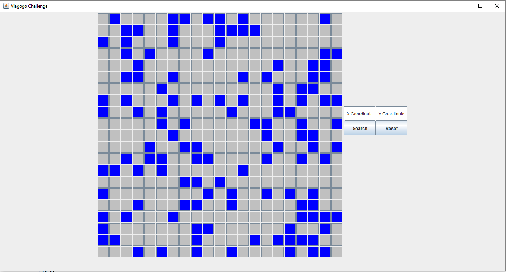
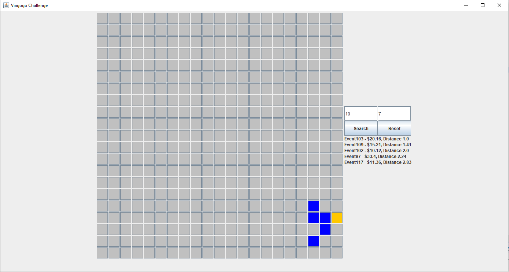

# GridMap_Challange

## Assumptions
* A maximum of 1000 tickets
* The event of the tile you selected will not be returned
* Price of tickets is random between $10 and $1500

## Building
This project uses Maven so to compile run in the main directory:

> mvn package

However, if you do not have Maven I have included a pre-compiled jar file which can be run with while in the main directory:

> java -cp .\target\viagogo-0.0.1-SNAPSHOT-jar-with-dependencies.jar display.DisplayWithGUI

## Usage
I have added a GUI that allows the user to click on locations on the grid instead of inputting the coordinates directly, however if you want to input coordinates there is a box for the x and y coordinates, after entering the coordinates the user should click the search button to search for the 5 closest events. There is also a reset button that will reset the gridmap back to its original state.

## How might you change your program if you needed to support multiple events at the same location?
I have a tile class that currently contains an optional type of Event this could be changed to an Arraylist to handle multiple events at a single location. The search algorithm would then have to fill its "found" ArrayList with all the events on that tile and display them as it was doing before.

## How would you change your program if you were working with a much larger world size?
I currently have variables that allow for the change of the grid size these are sizex, sizey, realStartx and realStarty. To change the size of the grid I would increase sizex and sizey and the realStartx and realStarty variables would be the starting x and y values on the grid (currently set at -10 -10). However, the larger the grid the less likely it will be to fit on the Graphical interface to fix this problem I would change the x and y size of the buttons to be (20x30)/size where size is the x or y size of the grid map. This would still provide problems of size at 200x200 where the boxes would be 3x3 pixels which would be quite small. In this case a zoom function could be added but I felt this was beyond the specification at this point.
